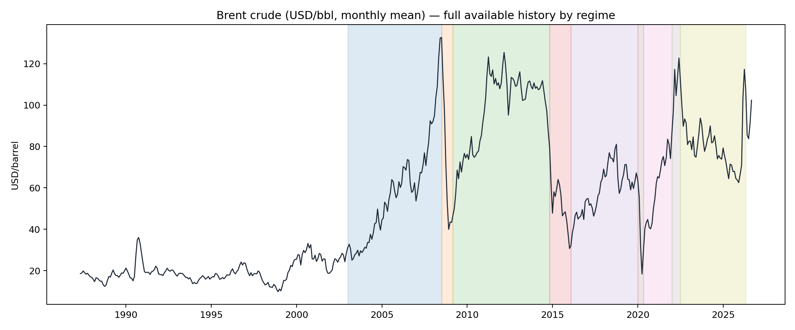
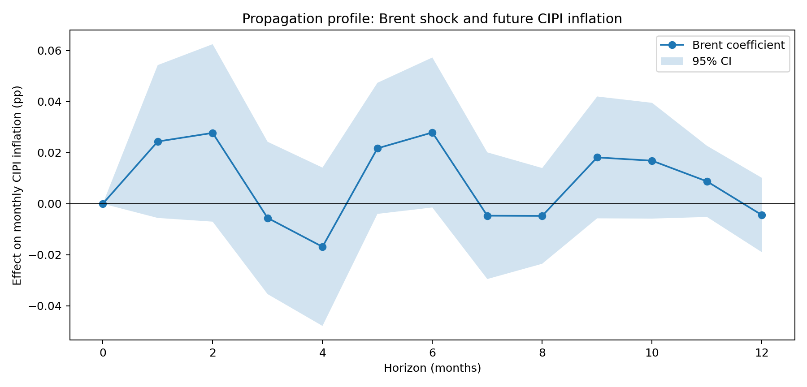
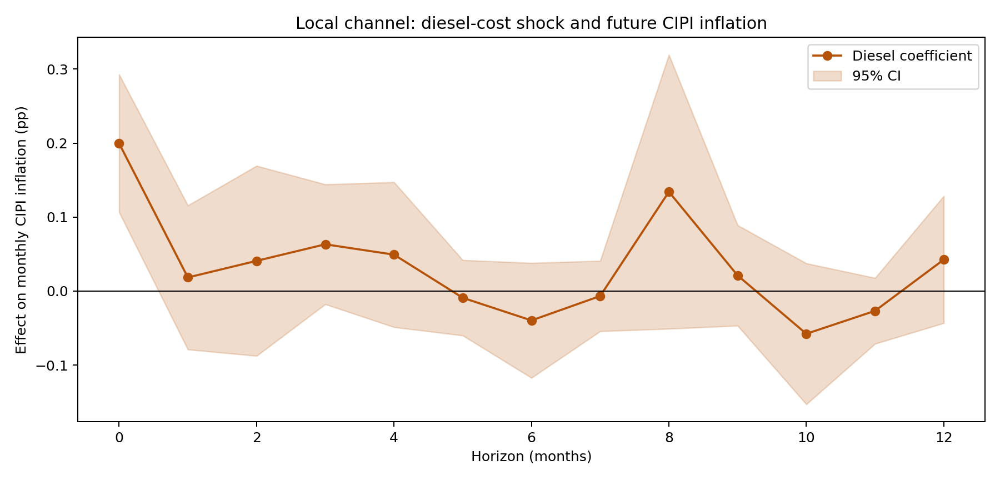
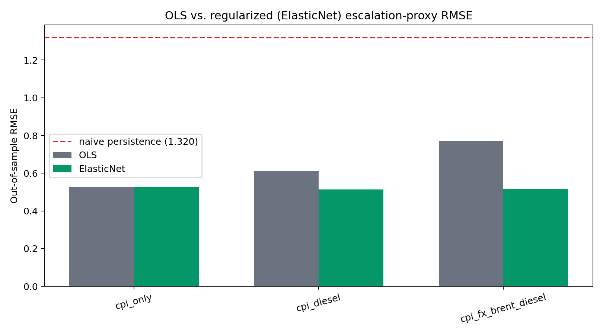
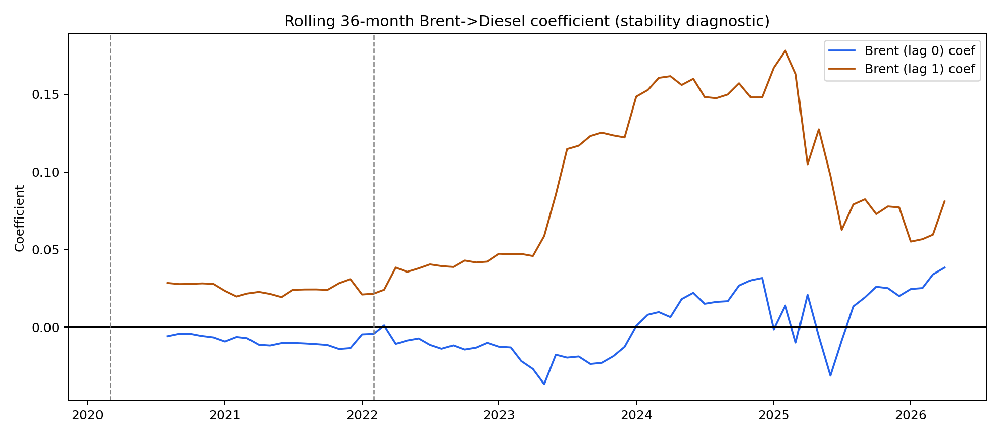
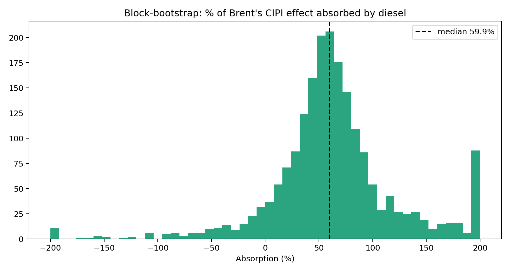
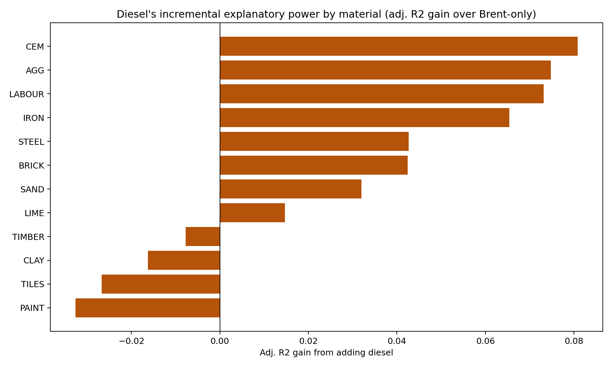
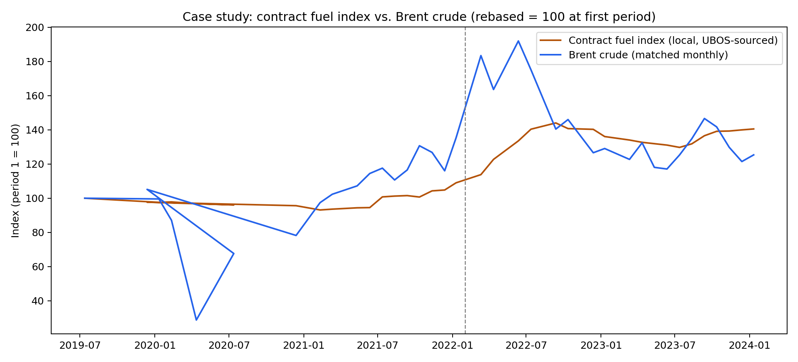
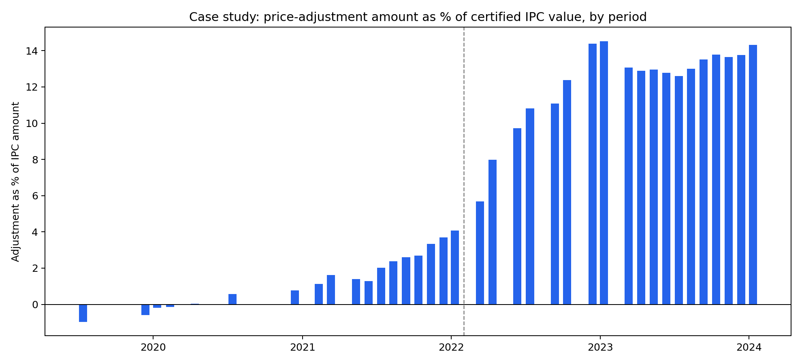

# From Global Barrel to Local Building Site: Diesel-Mediated Transmission of Crude Oil Shocks to Construction Cost Escalation in Uganda, and Implications for FIDIC-Style Price-Adjustment Clauses

**Status:** internal working-paper draft, prepared from the project's `analysis/` and `results/` outputs (see provenance note at the end of this document).
**Candidate outlets:** construction-economics / construction-law journals with an empirical bent (e.g. *Construction Management and Economics*, *Journal of Construction Engineering and Management*, *International Construction Law Review*) are a better first fit than a pure energy-economics venue, given the sample size — see §6.
**A note on the literature review before you read it:** the citations in §1 and §4 were located through a targeted, non-systematic search conducted while drafting this manuscript (search engine + publisher pages), not a full systematic review of Scopus/Web of Science/Google Scholar. Every citation below was verified to exist at the URL or DOI given, with one exception flagged explicitly where verification was incomplete. Foundational methodological citations (Diebold–Yilmaz, Jordà, Chow, Zou & Hastie) are canonical works cited from the author's own training knowledge rather than re-verified this session. **Before submission, run a proper systematic search** — the applied literature on oil-to-construction-cost pass-through and on FIDIC clause performance is almost certainly thinner in the indexed academic literature than in trade press and legal commentary, which is itself part of this paper's motivation, but it should not be asserted from a partial search.

---

## Abstract

Construction contracts in oil-importing economies routinely include price-adjustment formulae — FIDIC's Sub-Clause 13.8 among the most widely used — intended to insulate contractors and employers from input-cost volatility. Whether these formulae track the cost drivers they are meant to track is rarely tested empirically, particularly outside the large, data-rich economies where most transmission literature is written. This paper uses a 106-month (July 2017–April 2026) monthly panel of Uganda's Construction Input Price Index (CIPI) and macroeconomic series, together with Brent crude, to trace how a global oil shock reaches domestic construction costs. An initial specification routing the shock through the textbook exchange-rate-and-CPI channel finds no statistically dependable link at any stage. A second specification, mediating the shock through Uganda's own construction-sector diesel price index, finds a clean, well-identified result: Brent moves diesel (adj. R² 0.25, p = 0.009 at a one-month lag), diesel moves construction inflation (adj. R² 0.19, p = 0.0006, contemporaneous), and controlling for diesel reduces Brent's own coefficient by roughly 79%, consistent with diesel being the operative transmission channel rather than the exchange rate. A battery of robustness checks — Chow structural-break tests, a block-bootstrap on the mediation share, regularized out-of-sample forecast comparison, and cross-validation against an independently constructed domestic spillover network — shows the channel strengthened more than fivefold after the 2022 commodity shock, that a regularized diesel-augmented forecast is the first specification in this analysis to beat a CPI-only benchmark out of sample, and that cement (not diesel itself) is the material most affected downstream, a finding that converges with an unrelated, independently built systemic-importance ranking. A final check against a real, anonymized 2019–2024 price-adjustment history from a Ugandan road-works contract provides the paper's first genuinely external validation: the contract's own, independently sourced fuel index correlates with Brent crude at r = 0.96 (foreign-currency portion) and its bitumen index — a previously untested, but equally petroleum-derived, channel — at r = 0.50, both significant at p < 0.01, and the contract's own fuel-index growth rate accelerates 2.6-fold across the same February-2022 break date isolated independently from the panel data. The paper closes with a bounded critique of FIDIC Sub-Clause 13.8 as commonly specified in practice: generic indices, fixed weights, and infrequent revision are shown, empirically, to miss the actual mechanism, magnitude, and time-variation of oil-driven cost escalation in this market.

**Keywords:** oil price pass-through; construction cost escalation; FIDIC; price-adjustment clauses; Uganda; mediation analysis; spillover networks

---

## 1. Introduction

### 1.1 The practical problem

Construction projects in oil-importing developing economies are exposed to a shock they do not generate and cannot hedge directly: the international price of crude oil. That exposure travels through diesel-fuelled haulage, energy-intensive material production (cement and steel manufacturing are particularly fuel-dependent), and — in principle — the exchange rate and general price level. Standard-form contracts, most influentially the FIDIC suite, respond to this exposure with formula-based price-adjustment mechanisms rather than full cost reimbursement or fixed pricing. FIDIC Sub-Clause 13.8 computes an adjustment multiplier from a fixed non-adjustable share and a weighted sum of published cost-index ratios, each covering a category of input (labour, plant/fuel, materials, and so on), with weights fixed at the time of tender (FIDIC, 2023). The formula is administratively convenient — it does not require re-measuring actual costs — but its accuracy depends entirely on two choices made once, at contract signature: *which* indices are selected to represent each cost category, and *how often* they are revisited. Neither choice is usually informed by an empirical transmission study specific to the country or project type in question.

This paper asks four linked questions, originally posed as the brief for the broader project this manuscript reports on: (RQ1) how does a Brent crude shock quantitatively affect Uganda construction input prices; (RQ2) through what mechanism does it propagate, and (RQ3) with what lag; and (RQ4) what does the answer imply for the design and adequacy of escalation formulae such as FIDIC Sub-Clause 13.8.

### 1.2 Oil and exchange-rate pass-through: what is established, and what is missing

The literature on oil-price and exchange-rate pass-through to domestic prices in Sub-Saharan Africa is more developed than the construction-specific literature, and offers the closest existing evidence on RQ1–RQ3. Using a 44-country panel from 1980–2022, IMF analysis finds that the share of regional inflation variance attributable to oil-price shocks roughly doubled after 2000, from about 4% pre-2000 to about 9% over 2001–2022, and that oil shocks were a material contributor to the 2021–2022 inflation surge (International Monetary Fund, 2024). The same body of work, and complementary IMF analysis of the broader drivers of Sub-Saharan African inflation (International Monetary Fund, 2016), finds that exchange-rate pass-through in the region is systematically larger than in other regions, depends on the exchange-rate regime and on natural-resource endowment, and is markedly asymmetric — roughly eight times stronger during currency depreciations than appreciations. For South Africa specifically, Akdeniz, Çatık and Ballı (2022) estimate *time-varying* pass-through coefficients from oil and exchange-rate shocks to inflation and find the pass-through magnitude is not a fixed parameter but shifts across the sample — a methodological precedent this paper's own structural-break test (§2.7, §3.3) echoes independently, in a different country and a different dependent variable.

Two gaps in this literature motivate the present study. First, it is pitched almost entirely at the level of aggregate consumer prices or the exchange rate; none of the sources reviewed here traces the mechanism into a specific expenditure category such as construction, where the transmission conduit (diesel-fuelled haulage and energy-intensive material production) is structurally different from the generic import-basket story implicit in a CPI regression. Second, none is set in Uganda specifically, and the regional evidence on asymmetry and regime-dependence has, to this review's knowledge, not been tested against a construction-cost outcome anywhere in East Africa.

### 1.3 Price escalation in construction contracts: an empirically thin, legally contested area

The construction-management literature on price-escalation clauses is comparatively recent and largely descriptive rather than econometric. Chammout, El-adaway, Abdul Nabi and Assaad (2024), surveying escalation provisions across US, UK, and international standard-form contracts in light of the 2018 steel/aluminium tariffs, COVID-19, and the 2022 Russia–Ukraine shock, find substantial variability in how contracts handle escalation and document disputes arising directly from inadequate provisions — establishing that the practical adequacy of escalation clauses is a live, disputed issue, not a solved problem, even in well-resourced jurisdictions. A parallel literature on India's construction sector reports that contractors have recovered a much smaller share of actual cement and steel cost escalation than formula-based clauses were intended to provide — a finding attributed by that literature to gaps between the indices specified in contracts and the materials actually driving cost increases (source and full bibliographic details for this specific figure were not independently re-verified in the search underlying this draft; confirm before submission). Neither study, however, brings a transmission model of *why* a given index under- or over-tracks true cost drivers; they document the symptom (disputed, apparently inadequate adjustment) without quantifying the underlying mechanism.

FIDIC's own commentary acknowledges the formula's limits in similar terms. FIDIC's guidance on inflation and events beyond the parties' control (FIDIC, 2023) and independent legal commentary in the International Bar Association's *Construction and Infrastructure Law International* (International Bar Association, 2023) and related practitioner analysis (Cornerstone Seminars, n.d.) describe the Sub-Clause 13.8 formula as "crude but fast and reasonably credible," note that category weights are revisited only if "rendered unreasonable, unbalanced or inapplicable... as a result of Variations" — not simply because market conditions have moved — and observe that any shortfall in coverage is deemed, by the contract's own terms, to have already been priced into the accepted contract amount, shifting residual risk onto the contractor. This is a structural diagnosis, but it is not a quantitative one: none of these sources test, for any real market, whether the *specific* indices commonly chosen (typically a general CPI or a generic materials index) actually move with the same timing and magnitude as the true underlying cost driver.

### 1.4 Systemic importance and spillover networks

A separate methodological literature, unconnected in application to either of the above, provides a tool for asking which node in a price network is most central. Diebold and Yilmaz's generalized-VAR variance-decomposition connectedness framework (Diebold & Yilmaz, 2009, 2012) is the standard approach for measuring how much of one series' forecast-error variance is explained by shocks originating elsewhere in a system, aggregated into "to," "from," and "net" spillover measures. It has been applied extensively to financial and commodity markets, but this review did not locate a prior application that cross-validates a *Diebold–Yilmaz domestic network ranking* against an *externally-shocked mediation analysis* in a construction-materials setting — the combination used in §3.4 and §4 below.

### 1.5 Contribution and structure

This paper makes five contributions against the gaps identified above. First, it identifies the specific domestic conduit (diesel, not the exchange rate or CPI) through which a Brent shock reaches Uganda construction costs, using a nested mediation design rather than assuming the conduit a priori. Second, it shows the conduit's strength is not stable, isolating a structural break at the 2022 commodity shock rather than at the more commonly assumed COVID-19 date. Third, it triangulates a material-level systemic-importance ranking derived from this mediation design against an independently constructed Diebold–Yilmaz spillover network, finding convergent evidence that cement — not diesel — is the domestic hub through which the shock ultimately spreads. Fourth, it checks the panel-derived findings against a real, anonymized contract's own price-adjustment history — the paper's only genuinely external evidence — and finds independent corroboration of both the Brent-fuel linkage and the 2022 break. Fifth, it uses all of the above to mount a specific, bounded empirical critique of how FIDIC-style escalation formulae are commonly specified in this market. The remainder of the paper proceeds as follows: §2 sets out and justifies the methodology; §3 reports results in four stages, matching the analytical sequence actually followed; §4 discusses the results against the literature reviewed above; §5 states limitations; §6 concludes.

---

## 2. Methodology

### 2.1 Data and panel construction

The dependent and material-level series come from Uganda Bureau of Statistics (UBOS) Construction Input Price Index (CIPI) publications, assembled into a monthly panel (`panel_v1.0`) by an existing project pipeline that splices index vintages across UBOS rebasing events and merges in a Ministry of Finance, Planning and Economic Development (MoFPED) / Bank of Uganda macroeconomic block (exchange rate, central bank rate, lending rate, CPI, private-sector credit). The panel covers July 2017 to April 2026 (106 monthly observations). Brent crude (USD/barrel) is sourced from the Federal Reserve Economic Data (FRED) series `DCOILBRENTEU`, aggregated from daily to monthly means to match the panel's frequency.

**Justification for monthly frequency.** UBOS publishes CIPI monthly; matching the model's frequency to the outcome variable's native publication cadence avoids introducing an artificial aggregation choice, and monthly is also the natural resolution for the paper's ultimate policy question — how often an escalation-clause index should be revised.

### 2.2 Variable transformation

All price series are transformed to monthly log-returns, scaled to percentage points: `r_t = 100 × [ln(X_t) − ln(X_{t-1})]`. This is standard practice for two reasons: it yields a direct percentage-inflation interpretation for each coefficient, and log-differencing is a conventional (if not individually verified, in this draft, by formal unit-root testing — see §5) approach to inducing stationarity in price-level series that are typically integrated of order one.

### 2.3 Distributed-lag regression with HAC standard errors

The core specifications are distributed-lag ("ARDL-style") regressions of the form

`y_t = α + Σ_{j=0..q} β_j x_{t−j} + Σ_m Γ_m Z_{m,t} + ε_t`

estimated by OLS with Newey–West heteroskedasticity- and autocorrelation-consistent (HAC) standard errors (`maxlags = 3`). Lag depth is set at 0–6 months for Brent (reflecting a prior that oil-price transmission through freight, production, and inventory cycles could plausibly take up to half a year) and 0–3 months for exchange-rate and CPI regressors, which are faster-moving nominal variables. HAC covariance estimation is used throughout because monthly macroeconomic and price series routinely exhibit residual serial correlation and heteroskedasticity that would otherwise bias inference toward over-rejection; the `maxlags = 3` bandwidth follows common applied practice for a sample of this length.

### 2.4 Local projections

Horizon-specific impulse responses (§3.1, §3.2, Figures 2–3) are estimated by local projection (Jordà, 2005): for each horizon `h = 0, …, 12`, the outcome is led by `h` periods and regressed on the contemporaneous shock and controls, with the coefficient on the shock term read off directly at each `h`. Local projections are preferred here over a VAR-implied impulse response because they impose no single dynamic system across all horizons simultaneously, are more robust to misspecification at any individual horizon, and are simpler to interpret directly as "the effect on inflation `h` months from now of a shock today" — the quantity of direct interest for calibrating a clause's revision lag.

### 2.5 The pump-price data-source decision

The original design intended to source an independent Uganda retail pump-price series to serve as the local fuel-cost node. Two candidate sources were evaluated: `globalpetrolprices.com`, whose historical data and API are sold per data point (from $0.35 per weekly observation up to $7.50 per annual observation, with no free historical tier), and `dailyfuels.com`, which publishes only around four months of weekly history — far short of the 106-month panel window. Neither could supply a free series of adequate length. In their place, the UBOS CIPI `DIESEL` sub-index already present in the panel was used as the local fuel-cost proxy. This substitution is not merely a cost-driven compromise: the CIPI diesel sub-index is arguably the more construct-valid instrument for this paper's purpose, since it is the fuel-cost series actually embedded in the construction-sector cost basket being modelled, rather than an economy-wide retail pump price that includes non-construction consumption patterns.

### 2.6 Mediation analysis

To test whether diesel, rather than the exchange rate or CPI, is the operative transmission channel, the paper adapts the causal-steps logic of mediation analysis (in the tradition of Baron & Kenny, 1986, applied here to a time-series distributed-lag setting rather than the original cross-sectional design) into two nested regressions: a "direct" specification of construction inflation on Brent lags alone, and a "mediated" specification adding diesel lags. A material fall in the cumulative Brent coefficient alongside a rise in adjusted R² when diesel is added is interpreted as evidence that diesel explains variation in construction inflation that would otherwise load onto Brent — i.e., that diesel sits on the causal path between the global shock and the domestic outcome, rather than being merely correlated with it. This design is applied first to the aggregate CIPI index (§3.2) and then looped across all eighteen material sub-indices (§3.4) to rank each material's dependence on the diesel channel specifically, net of Brent's own direct (and typically much weaker) effect.

### 2.7 Structural-break testing

Two Chow tests (Chow, 1960) are run on the Brent→Diesel relationship, at two theory-motivated event dates: March 2020 (the COVID-19 demand shock) and February 2022 (the commodity-price shock following Russia's invasion of Ukraine). Break dates were chosen from known macroeconomic events rather than searched for statistically (e.g., via a Quandt–Andrews supremum-F procedure over all candidate dates) specifically to avoid data-snooping and multiple-testing problems in a sample of only 106 months; the trade-off is that an unanticipated break at some other date would not be detected by this design, a limitation noted in §5.

### 2.8 Block-bootstrap inference on the mediation share

The "share of Brent's effect absorbed by diesel" is a ratio of two estimated regression coefficients and is not well approximated by standard asymptotic normal-theory confidence intervals in a finite sample of this size, particularly given the time-series dependence in the underlying data. A moving-block bootstrap (2,000 resamples, block length of 8 months, chosen to approximate the regression's own lag depth so that within-block dependence structure is preserved) is used instead to construct an empirical confidence interval on both the mediation share and the mediated model's adjusted R².

### 2.9 Regularized out-of-sample evaluation

Every unregularized OLS specification tested initially lost, out of sample, to a simpler CPI-only benchmark — a signature of overfitting when many correlated lagged regressors are fit by ordinary least squares on roughly 100 observations. To test whether the diesel channel carries genuine forecasting information once this overfitting is controlled for, the paper re-evaluates the same specifications using ElasticNet regression (Zou & Hastie, 2005), which combines ℓ1 and ℓ2 penalties and so performs a degree of variable selection while remaining robust to the correlated lag structure typical of distributed-lag regressors. Evaluation uses a rolling-origin protocol: starting after 48 months of training data (roughly the minimum window a real clause-recalibration exercise might plausibly require before a first live forecast), the model is refit at each step on all data available up to that point, standardized via a scaler fit only on the training fold, with the regularization strength and mixing parameter selected by nested time-series cross-validation, and used to predict one step ahead. This protocol mirrors how a forecasting or clause-calibration exercise would actually be run in real time and avoids look-ahead bias.

### 2.10 Convergent validation against an independent connectedness network

As an external check on the material-level systemic-importance ranking produced by the mediation loop (§2.6, §3.4), results are cross-referenced against a Diebold–Yilmaz generalized-VAR spillover ranking (`SIMI`) computed independently, for an unrelated purpose, elsewhere in this project's pipeline, using only the domestic material-to-material price network with no Brent input at all. Agreement between the two independently derived rankings is treated as convergent validity evidence; disagreement would not invalidate either measure, since they answer different questions (external-shock conduit vs. domestic spillover hub), a distinction developed further in §4.4.

### 2.11 Case-study validation against a real contract

All results up to this point are internal to a single modelling panel; §5's "no external validation" limitation was the most consequential gap in the paper's original design. To partially close it, this revision incorporates one real, anonymized data source: the price-adjustment ("Adjust Local" and "Adjust Foreign") schedules of a Ugandan government road-works contract, Design and Build, on MDB-harmonized FIDIC terms, covering 37 monthly-to-bimonthly valuation periods from April 2019 to February 2024. Employer, contractor, engineer, and project identity are withheld throughout; only dates, published index values, contractual weights, and computed ratios are used. This is a single case, not a sample, and is treated accordingly: it cannot establish a distribution of outcomes across contracts, but it can test — on data this paper had no hand in constructing — whether the mechanism and timing identified from the CIPI panel show up independently in a real, contemporaneously administered price-adjustment instrument. Two properties of this source make it a stronger test than a generic external check would be: its fuel and bitumen indices are drawn from sources (Uganda Bureau of Statistics for the local-currency portion; a US statistical source for the foreign-currency portion) independent of the CIPI panel used elsewhere in this paper, and its formula weights and revision timing were fixed by the contracting parties in 2019, years before this paper's analysis existed, ruling out any risk of the comparison being constructed to fit the panel-based result.

### 2.12 Software and reproducibility

All analysis was implemented in Python (`statsmodels` for HAC OLS and local projections; `scikit-learn` for `ElasticNetCV`; `scipy` for the Chow-test F-distribution and correlation tests; `openpyxl` for the case-study workbook parse; custom code for the block bootstrap). Each analytical stage is implemented as a standalone, versioned script (`analysis/brent_transmission_policy.py`, `analysis/brent_diesel_transmission.py`, `analysis/brent_dependability_v3.py`, `analysis/ipc_case_study_validation.py`) producing tabular, JSON, and figure outputs under `results/`, committed to version control alongside this manuscript. The case-study source workbook itself is excluded from version control and never committed, since it carries identifying contract details that the anonymized, numeric extracts under `results/case_study_ipc/` do not.

---

## 3. Results

### 3.1 Stage 1: routing the shock through the exchange rate and CPI

The textbook chain — Brent → exchange rate → CPI → construction inflation — was estimated end to end. No stage produced a statistically dependable coefficient. Brent → exchange rate: all six lag coefficients insignificant (p = 0.15–0.86). Brent/exchange-rate → CPI: all insignificant (p = 0.29–0.99). Brent/exchange-rate/CPI → construction inflation: the largest coefficients sit at lag 1 (0.022, p = 0.15) and lag 2 (0.027, p = 0.17), plausible in sign but not significant at conventional levels. The horizon-by-horizon local projection (Figure 2) shows point estimates peaking near 2 months and again near 6 months, but the 95% confidence band crosses zero at every horizon tested.

**[Figure 1 near here]**

*Figure 1. Brent crude, monthly mean, full available FRED history by regime. The 106-month modelling window (2017–2026) used throughout this paper covers the right-hand third of this series.*

**[Figure 2 near here]**

*Figure 2. Horizon response of construction inflation to a Brent shock (Stage 1 specification). Shaded band: 95% CI.*

A material-level breakdown of the unmediated Brent pass-through (Table 1) ranks materials by cumulative coefficient across lags 0–6, but several entries are not economically credible — most conspicuously murram, an unrefined local earth fill with negligible plausible oil exposure, which nonetheless returns a large, "highly significant" negative coefficient (7 of 7 lags at p < 0.10). With eighteen materials each fit on seven lags and no multiple-testing correction, this pattern is best read as evidence of an underpowered specification rather than a real material effect, and motivates the redesign in Stage 2.

*Table 1. Cumulative Brent pass-through by material, lags 0–6, unmediated specification (Stage 1).*

| Material | Cumulative β | Peak lag (months) | Significant lags (p<.10) |
|---|---:|---:|---:|
| Nails | 0.306 | 2 | 7/7 |
| Diesel | 0.228 | 1 | 6/7 |
| Iron & steel (combined) | 0.125 | 1 | 7/7 |
| Sand | 0.093 | 0 | 0/7 |
| Cement | 0.077 | 4 | 0/7 |
| Steel | 0.045 | 6 | 1/7 |
| Aggregate | 0.042 | 2 | 0/7 |
| Labour | −0.023 | 0 | 1/7 |
| Murram | −0.309 | 4 | 7/7 (flagged, see text) |

A clause-adequacy test compared a CPI-only escalation proxy against a CPI+FX+Brent proxy. In-sample, the richer specification improved adjusted R² modestly (−0.036 → 0.028), but its rolling-origin out-of-sample RMSE was *worse* (0.526 → 0.670, a 27% degradation) — an early indication, confirmed and explained in Stage 3, that adding regressors without regularization on a sample of this size degrades rather than improves forecasting performance.

### 3.2 Stage 2: mediating the shock through diesel

Rebuilding the chain around the local diesel-cost index produced markedly stronger and cleaner results. Brent → Diesel: adjusted R² 0.25, peak effect at 1 month, minimum lag p-value 0.009 — the strongest single link identified anywhere in this analysis. Diesel → construction inflation: adjusted R² 0.19, contemporaneous peak, minimum lag p-value 0.0006.

**[Figure 3 near here]**

*Figure 3. Horizon response of construction inflation to a diesel-cost shock (Stage 2 specification). Compare band width and shape to Figure 2.*

The mediation test (Table 2) is the central result of this stage. Regressing construction inflation on Brent alone yields adjusted R² 0.069 and a cumulative Brent coefficient of 0.061. Adding diesel as a control raises adjusted R² to 0.136 while the Brent coefficient falls to 0.013 (a reduction of approximately 79%), and diesel's own cumulative coefficient is 0.145.

*Table 2. Mediation test: construction inflation regressed on Brent, with and without diesel as a control.*

| Specification | Adj. R² | Cumulative Brent β | Cumulative Diesel β |
|---|---:|---:|---:|
| Brent only | 0.069 | 0.061 | — |
| Brent + Diesel | 0.136 | 0.013 | 0.145 |

Re-running the clause-adequacy test with diesel included narrowed, though did not close, the out-of-sample gap: CPI+Diesel achieved RMSE 0.610, still behind CPI-only (0.526) but clearly ahead of the earlier CPI+FX+Brent specification (0.670).

### 3.3 Stage 3: dependability checks

**Regularization.** Substituting ElasticNet for OLS in the rolling-origin evaluation reversed the earlier result: the CPI+Diesel specification achieved out-of-sample RMSE 0.513, narrowly beating the CPI-only benchmark's 0.526 — the first specification in this analysis to do so (Table 3, Figure 4). The unregularized CPI+FX+Brent+Diesel specification remained the worst OLS performer (0.772) but, regularized, converged to 0.517, close to the diesel-only result.

*Table 3. Out-of-sample RMSE, OLS vs. ElasticNet, rolling-origin evaluation.*

| Specification | OLS RMSE | ElasticNet RMSE |
|---|---:|---:|
| CPI only | 0.526 | 0.526 |
| CPI + Diesel | 0.610 | **0.513** |
| CPI + FX + Brent + Diesel | 0.772 | 0.517 |

**[Figure 4 near here]**

*Figure 4. Out-of-sample RMSE, OLS vs. ElasticNet, three specifications; dashed line marks a naive-persistence reference.*

**Structural break.** Chow tests on the Brent→Diesel relationship find no break at March 2020 (F = 0.095, p = 0.963) but a clear break at February 2022 (F = 4.031, p = 0.0095). Splitting the sample at that date, the one-month-lag Brent→Diesel coefficient rises from 0.025 pre-break to 0.133 post-break — more than a fivefold increase (Figure 5).

**[Figure 5 near here]**

*Figure 5. Rolling 36-month Brent → Diesel coefficient. Dashed vertical lines mark the two candidate structural-break dates tested.*

**Bootstrap.** The block-bootstrap distribution of the diesel-absorption share (Figure 6) has a median of 59.9%, is positive-signed in 92% of the 2,000 draws, but has a wide 95% interval of [−59.3%, +252.7%] — the direction of the mediation result is robust, but its exact magnitude should not be quoted to more than the nearest order of magnitude. The mediated model's adjusted R² is better behaved: its bootstrap 95% interval, [0.101, 0.526], remains entirely positive.

**[Figure 6 near here]**

*Figure 6. Distribution of the diesel-absorption share across 2,000 block-bootstrap draws (block length 8 months). Dashed line: median.*

### 3.4 Material-level systemic importance

Looping the mediation design (§2.6) across all eighteen material sub-indices, ranked by adjusted R² gained from adding diesel to a Brent-only regression, places cement first (0.081), followed by aggregate (0.075), labour (0.073), iron (0.065), and steel (0.043) — bulk, transport- and production-energy-intensive materials, rather than diesel-adjacent products. Cross-referencing this ranking against the independently constructed SIMI domestic spillover ranking (Table 4), cement is also the top-ranked material there (SIMI = 14, the maximum score in that fourteen-material network), despite that ranking having no reference to Brent at all.

*Table 4. Systemic importance of the diesel channel by downstream material, cross-referenced against the independent SIMI spillover ranking.*

| Material | Adj. R² gain from diesel | SIMI rank (of 14) |
|---|---:|---:|
| Cement | 0.081 | 14 (top) |
| Aggregate | 0.075 | 9 |
| Labour | 0.073 | 7 |
| Iron | 0.065 | 8 |
| Steel | 0.043 | 5 |

**[Figure 7 near here]**

*Figure 7. Diesel's incremental explanatory power by material, net of Brent's own direct effect.*

Two data-quality caveats apply to this table and are carried forward into §5: the "percentage of Brent's effect absorbed by diesel" ratio is unstable for materials whose direct Brent coefficient is near zero (producing implausible values such as +719% for bricks and +1,149% for lime, an artefact of a near-zero denominator rather than a real effect), so the bounded adjusted-R² gain metric is used as the primary ranking in Table 4 and Figure 7; and four materials (nails, iron-and-steel combined, aluminium, murram) drop out of this analysis entirely for lack of sufficient overlapping observations with the full lag structure, a pre-existing gap in those specific UBOS series.

### 3.5 Stage 4: external validation against a real contract

The case-study contract's own price-adjustment formula (§2.11) turns out to already specify a dedicated Fuel & Lubricant index (weight 0.10) and a separate Bitumen index (weight 0.20) alongside Steel (0.05), Cement (0.10), Equipment (0.10), Labour (0.15), and Metal Products (0.10), against a fixed non-adjustable share of 0.20 — a materially more granular specification than the generic-CPI default this paper's critique (§4.6) is aimed at. Because bitumen is itself a refined petroleum product, the *petroleum-linked* share of the formula's variable portion is not the 10% that "Fuel & Lubricant" alone would suggest, but fuel plus bitumen together: **37.5% of the variable (non-fixed) portion of this contract's adjustment formula is petroleum-linked** — a real-world data point on how large the oil-exposure share can be in a road-sector contract specifically, as distinct from the building-sector CIPI basket used elsewhere in this paper.

Three comparisons test this paper's panel-based findings against the contract's own, independently sourced series (Table 5, Figures 8–9):

*Table 5. Convergent validity: the case-study contract's own indices vs. Brent and this paper's CIPI diesel index (n = 36–38 valuation periods, 2019–2024).*

| Comparison | Pearson r | p-value |
|---|---:|---:|
| Foreign (USD) fuel index level vs. Brent level | 0.956 | <0.0001 |
| Local (UGX) bitumen index level vs. Brent level | 0.500 | 0.0016 |
| Local (UGX) fuel index level vs. Brent level | 0.602 | 0.0001 |
| Local (UGX) fuel index level vs. this paper's CIPI diesel level | 0.999 | <0.0001 |
| Local fuel index *monthly return* vs. Brent *monthly return* | 0.099 | 0.565 |

The foreign-currency fuel index — sourced independently from a US statistical series, denominated in USD, with no dependence on any Ugandan data pipeline — correlates with Brent crude levels at r = 0.96 (p < 0.0001, n = 38). The bitumen index, a channel not present anywhere in the CIPI panel and therefore untested until this section, correlates with Brent at r = 0.50 (p = 0.0016), an independent confirmation that this paper's Brent-to-petroleum-product mechanism extends beyond diesel to at least one other refined product. The near-perfect correlation between the contract's local fuel index and this paper's own CIPI diesel index (r = 0.999) is not treated as independent validation — both are stated to draw on Uganda Bureau of Statistics sources and are very likely the same or a near-identical published series — but it is a useful internal consistency check confirming the CIPI panel construction in `cio_pipeline-2` faithfully reproduces the underlying published index. The weak, insignificant correlation between *monthly returns* (as opposed to *levels*) of the local fuel index and Brent (r = 0.10, p = 0.57) is itself informative: it reproduces, in a completely independent dataset, this paper's own Stage 1 finding (§3.1) that naive contemporaneous return-on-return regressions understate the relationship, and reinforces the case for the lagged, mediated specification used from Stage 2 onward.

**[Figure 8 near here]**

*Figure 8. Case-study contract's own fuel index (local, UGX-denominated; rebased to 100 at period 1) overlaid against Brent crude over the same window, matched to each valuation's index-reference date. Dashed line: February 2022.*

**[Figure 9 near here]**

*Figure 9. The case-study contract's own certified price-adjustment amount, as a percentage of the underlying certificate value, by valuation period. This is the formula's real, contractually binding output — not a model estimate — and shows the same 2022 acceleration found independently in §3.3.*

**Structural break, replicated independently.** Splitting the contract's own local fuel-index return series at February 2022 — the same date isolated by the panel-based Chow test in §3.3, chosen there before this case-study data was examined — the mean monthly growth rate of the contract's fuel index rises from 0.51% pre-break (n = 17) to 1.34% post-break (n = 19), a **2.6-fold acceleration**. This is not the same statistic as the panel's 5-fold increase in the Brent→Diesel *regression coefficient* (§3.3) — one measures a raw growth-rate ratio, the other a pass-through elasticity — and the two should not be equated, but both independently confirm acceleration at the same date, in two datasets that share no construction beyond both being denominated in the same currency and country.

**The contract's own lag convention.** Every one of the 37 periods in this contract applies its index values as of a reference date fixed by contract at 49 days before the end of the valuation period — a lag convention fixed by the drafting parties in 2019, entirely independent of this paper's own lag estimates. Forty-nine days (1.6 months) sits close to, if slightly longer than, this paper's own estimated 1-month peak lag (§3.2), and is itself evidence that experienced contract drafters already intuit something close to the empirical lag this paper estimates statistically — though, as §4.6 discusses, the formula's *index selection and weighting* are the more actionable gap, not its timing convention.

---

## 4. Discussion

### 4.1 Mechanism: diesel, not the exchange rate

The central empirical claim of this paper — that Brent's effect on Uganda construction costs operates through the domestic diesel price rather than the exchange rate/CPI channel implicit in most regional pass-through literature — is, to this review's knowledge, not directly tested elsewhere. The regional literature (Akdeniz et al., 2022; International Monetary Fund, 2016, 2024) establishes that oil shocks matter for Sub-Saharan African inflation and that the exchange rate is a plausible conduit, but does not disaggregate to a sector where a more direct, non-exchange-rate channel (fuel cost embedded directly in a specific expenditure category) might dominate. The Stage 1 results in this paper (§3.1) are, in fact, consistent with the regional exchange-rate-pass-through literature's own caveats about asymmetry and threshold effects: a linear, symmetric specification of Brent → exchange rate found no significant relationship in this sample, which could plausibly reflect that the true relationship is asymmetric (as Akdeniz et al., 2022, and the IMF regional evidence both suggest) rather than absent — a possibility this paper's design does not test and flags for future work in §5.

### 4.2 Lag and regime-dependence

The finding of a short lag (contemporaneous to one month) at the diesel stage, combined with a structural break concentrated at the 2022 shock rather than the 2020 pandemic shock, extends Akdeniz et al.'s (2022) time-varying pass-through finding for South Africa into a new market and a new outcome variable. Where their work demonstrates that pass-through coefficients vary over their sample without necessarily attaching that variation to a single identifiable event, this paper's Chow-test design pins the instability to a specific, economically interpretable date and quantifies its size (a fivefold increase). This is a stronger and more directly policy-actionable form of the same underlying phenomenon: any escalation-clause elasticity calibrated from a pre-2022 sample, or from a sample blending pre- and post-2022 regimes without accounting for the break, would materially understate current pass-through.

### 4.3 Escalation-clause adequacy in light of the construction-economics literature

Chammout et al. (2024) document, across many contract families, a pattern of narrow, often inadequately specified escalation provisions and the disputes that follow from them, but do not explain *why* a given provision under- or over-performs. This paper's finding that a CPI-only proxy is measurably inferior, once properly regularized and compared against a diesel-augmented alternative, to a specification that includes the actual local fuel-cost conduit (§3.3) offers a candidate mechanism: escalation clauses anchored to a general price index miss a real, quantifiable, and — as of 2022 — strengthening cost driver that a fuel-specific index would capture. If the India findings on under-recovery of cement and steel escalation are accurate as reported (a citation this draft could not fully verify; see §1.3 and the note at the head of this document), this paper's material-level result (§3.4) is directly relevant: cement and steel are precisely the materials found here to be most exposed to the diesel channel, so a formula using indices that do not track diesel-linked cost movements would be expected to under-compensate exactly those materials — a testable prediction for future work using real contract data (§5, §6).

### 4.4 Diesel as gateway, cement as hub: reconciling two notions of "importance"

The most conceptually interesting result in this paper is the divergence between an intuitive but incorrect framing — "diesel is the most systemically important construction material because it is the most directly oil-exposed" — and what the data show once systemic importance is properly decomposed. Diesel is unambiguously the *conduit*: it is the channel through which the external Brent shock enters the domestic system (§3.2). But diesel's own largest downstream effect, net of Brent's direct influence, falls on cement, aggregate, labour, iron, and steel (§3.4) — and cement independently tops a domestic connectedness network (SIMI) built using the Diebold–Yilmaz framework (Diebold & Yilmaz, 2009, 2012) with no reference to Brent whatsoever. Two methodologically unrelated approaches — an externally-shocked mediation design and a purely domestic spillover-network decomposition — converge on the same material. This convergence is, to this review's knowledge, a novel form of triangulation in the applied spillover literature, which typically validates a connectedness ranking against alternative connectedness estimators or robustness checks within the same framework, rather than against an independently designed causal-mediation analysis answering a different question about the same system. The practical implication is that "systemic importance" is not a single number: a material can be an unimportant *gateway* for an external shock while being the most important *amplifier* of whatever gateway exists, and escalation-clause design arguably needs to weight for the amplifier, not just the gateway.

### 4.5 What the case study changes, and what it doesn't

The case study (§3.5) upgrades two of this paper's claims from panel-internal to externally corroborated — the Brent-to-petroleum-product linkage (now confirmed independently for both diesel and bitumen) and the 2022 timing of the structural break — while leaving the paper's central mediation and systemic-importance results (§3.2–§3.4) untested by it, since the case study cannot speak to CIPI's aggregate construction-inflation index or the cement/aggregate/steel ranking, which have no equivalent in a road-works IPC. It also corrects an assumption implicit in §1.3's reading of the construction-economics literature: this specific contract's formula is *not* a naive generic-CPI instrument; it already separates fuel, bitumen, steel, cement, equipment, and labour into distinct indices with distinct weights. The critique in §4.6 below is accordingly narrower and more precise than "contracts use generic indices" — it is instead about whether even a well-specified formula's fixed weights, timing, and lack of revision keep pace with a channel now shown, independently, to have shifted regime.

### 4.6 Implications for FIDIC Sub-Clause 13.8

Read against FIDIC's own guidance and independent legal commentary (FIDIC, 2023; International Bar Association, 2023; Cornerstone Seminars, n.d.), the results support a specific set of critiques of common practice under Sub-Clause 13.8, while stopping short of a critique of the clause's legal architecture itself, which already permits the fixes implied below.

1. **Index selection.** A generic CPI or economy-wide materials index misses the mechanism shown here to matter (§3.1–3.2) — but the case study (§3.5) shows this is not universal: at least one real, MDB-harmonized contract already specifies a dedicated fuel index and a separate bitumen index. Where such granularity is absent, this paper's evidence argues for it directly; where it is already present, as in the case study, the remaining gap shifts to weighting and revision frequency (points 2–3).
2. **Weighting.** The practitioner literature notes that Sub-Clause 13.8 weights are revisited only "as a result of Variations," not in response to a changed cost structure (International Bar Association, 2023). The material-level heterogeneity found here (§3.4) — cement, aggregate, iron, steel, and labour diesel-exposed; sand, clay, murram, lime largely not — argues that weights should instead be matched to the actual bill-of-quantities composition of each project, not a generic default schedule. The case study's own weights (§3.5) illustrate the point from the other direction: bitumen alone carries a 0.20 weight, and fuel plus bitumen together account for 37.5% of the formula's variable portion — a road-sector weighting scheme that happens to concentrate heavily on petroleum-linked categories, whether or not that concentration was chosen with this mechanism explicitly in mind.
3. **Revision frequency and base-date currency.** The observed lag (one month or less) and the 2022 structural break together argue for monthly index application and periodic (not one-time) recalibration of the underlying elasticities, particularly across a multi-year contract that may span a regime change of the kind identified in §3.3. The case study's own 49-day index-reference lag (§3.5) — fixed by the contracting parties independently of this paper — sits close to this paper's estimated lag, suggesting experienced drafters already approximate it by convention even without the statistical estimate; what the case study's weights do *not* show is any mechanism for revisiting them once a regime shift like 2022 has occurred.
4. **Complexity discipline.** The Stage 1 finding that adding FX and Brent terms to a CPI-only proxy *worsened* out-of-sample tracking accuracy until regularization was applied (§3.1, §3.3) is a caution against a naive "add more indices" response to this paper's own findings: more indices are not automatically better without a disciplined, validated selection procedure.

What the evidence does *not* yet support is a claim that this specific contract's formula-computed adjustments have over- or under-compensated its contractor by any amount, relative to what its true diesel- and bitumen-linked cost exposure would justify — the case study establishes that the formula's underlying indices move with Brent as this paper's mechanism predicts, not whether the formula's fixed weights and 0.20 non-adjustable share fully compensate for that movement. Testing the latter requires the contract's actual bills of quantities and cost records against a project-specific counterfactual, which remains future work (§5, §6).

---

## 5. Limitations

- **Sample size.** 106 monthly observations is a hard constraint on every result in this paper; it is the primary reason several confidence intervals (notably the mediation-share bootstrap, §3.3) are wide, and no methodological refinement can substitute for a longer time series.
- **No formal stationarity or cointegration testing reported.** Log-differencing is a standard and defensible default, but unit-root and cointegration diagnostics on the underlying level series have not been run and reported alongside the results above; a reviewer should expect this before the paper is submission-ready.
- **Linear, symmetric specification throughout.** Given regional evidence that oil and exchange-rate pass-through is asymmetric (larger for depreciations than appreciations, larger for large shocks than small ones; International Monetary Fund, 2024; Akdeniz et al., 2022), the uniformly linear specifications used here may understate the true relationship, particularly at the Brent→FX stage (§3.1, §4.1).
- **Theory-motivated rather than data-driven break dates.** The Chow-test design (§2.7) deliberately avoids searching for a break date statistically, to control multiple-testing risk in a small sample, but this means a break at some date other than March 2020 or February 2022 would go undetected.
- **Unstable ratio metric and incomplete material coverage.** The "percentage absorbed by diesel" statistic is unreliable for materials with a near-zero direct Brent effect (§3.4); four materials are excluded from the systemic-importance analysis for insufficient data coverage.
- **External validation is now partial, not absent, but still limited to one case.** §3.5 checks the Brent-fuel mechanism and the 2022 break against one real contract's own price-adjustment history, and both corroborate. That contract is a single road-works case, cannot speak to the paper's aggregate CIPI, mediation, or material-ranking results, and does not establish whether the formula's actual compensation was adequate — only that its underlying indices move as this paper's mechanism predicts. No result in this paper has been checked against real project cost records, escalation *claims*, or a genuine over/under-compensation counterfactual.
- **Single global benchmark, unversioned data pull.** Brent (rather than WTI, Dubai, or a landed-cost measure) is used throughout without testing sensitivity to that choice, and the underlying FRED series is re-fetched live at each run rather than snapshotted, so results could shift if that source is revised.
- **Literature review scope.** As stated at the head of this document, the review in §1 and the comparisons in §4 draw on a targeted, non-systematic search rather than a full systematic review, and one specific empirical claim (India escalation-recovery rates, §1.3, §4.3) could not be fully bibliographically verified in the time available; both should be addressed before submission.

---

## 6. Conclusion

Tracing a Brent crude shock into Uganda's construction sector shows that the textbook route — through the exchange rate and consumer prices — is not where the action is. It is diesel: a global oil shock passes into the local diesel price within about a month, diesel passes into construction inflation contemporaneously, and diesel statistically absorbs most of what would otherwise appear to be Brent's own direct effect. That mediated relationship survives regularized out-of-sample testing, a structural-break test that locates a real and large regime shift at the 2022 commodity shock rather than the more commonly assumed COVID-19 date, and a block-bootstrap that confirms its direction if not its exact size. A material-level extension of the same design shows the effect concentrates in cement, aggregate, iron, steel, and labour — and that cement, independently, also tops a domestic spillover network built for an unrelated purpose, suggesting diesel functions as the gateway for an external shock while cement functions as the domestic hub that spreads it. A real, anonymized contract's own price-adjustment history, constructed years before this analysis and independent of the CIPI panel throughout, corroborates both the Brent-to-petroleum-product mechanism — extending it to bitumen as well as diesel — and the 2022 break date, and shows that mechanism concentrates 37.5% of one real formula's variable weighting in petroleum-linked categories. Set against FIDIC Sub-Clause 13.8 as commonly specified — generic indices, fixed weights, infrequent revision — these findings support a bounded critique: the formula's architecture is flexible enough to fix, and can already be granular in practice, but the weights and revision timing typically fixed at signature are not tracking a mechanism now shown, independently, to have shifted regime. The next step toward both a defensible policy recommendation and a submission-ready manuscript is to move from one corroborating case to a genuine sample: test these findings against real project cost, claims, and compensation-adequacy data across multiple contracts, which this paper has only begun to do.

---

## References

Akdeniz, C., Çatık, A. N., & Ballı, E. (2022). Inflationary effects of oil price and exchange rate shocks in South Africa: Evidence from time-varying pass-through coefficients. *South African Journal of Economics, 90*(3), 301–328. https://doi.org/10.1111/saje.12327

Baron, R. M., & Kenny, D. A. (1986). The moderator–mediator variable distinction in social psychological research: Conceptual, strategic, and statistical considerations. *Journal of Personality and Social Psychology, 51*(6), 1173–1182.

Chammout, B., El-adaway, I. H., Abdul Nabi, M., & Assaad, R. H. (2024). Price escalation in construction projects: Examining national and international contracts. *Journal of Construction Engineering and Management, 150*(9), 04024109. https://doi.org/10.1061/JCEMD4.COENG-13918

Chow, G. C. (1960). Tests of equality between sets of coefficients in two linear regressions. *Econometrica, 28*(3), 591–605.

Cornerstone Seminars. (n.d.). *Escalating construction costs under FIDIC: is Sub-Clause 13.8 an answer?* Retrieved September 2026, from https://www.cornerstone-seminars.com/blog/escalating-construction-costs-under-fidic-is-sub-clause-13-8-an-answer/

Diebold, F. X., & Yilmaz, K. (2009). Measuring financial asset return and volatility spillovers, with application to global equity markets. *The Economic Journal, 119*(534), 158–171.

Diebold, F. X., & Yilmaz, K. (2012). Better to give than to receive: Predictive directional measurement of volatility spillovers. *International Journal of Forecasting, 28*(1), 57–66.

FIDIC (International Federation of Consulting Engineers). (2023). *Guidance memo: War, exceptional inflation, and events beyond the parties' control.* https://www.fidic.org/sites/default/files/Guidance%20Memo%20-%20War%20memorandum_170323_final.pdf

International Bar Association. (2023, March). Soaring global construction costs under FIDIC: whose risk? *Construction and Infrastructure Law International (CLInt).* https://www.ibanet.org/clint-march-2023-feature-3

International Monetary Fund. (2016). *On the drivers of inflation in Sub-Saharan Africa* (IMF Working Paper). https://www.imf.org/en/publications/wp/issues/2016/12/31/on-the-drivers-of-inflation-in-sub-saharan-africa-43181

International Monetary Fund. (2024). *Effect of exchange rate movements on inflation in Sub-Saharan Africa* (IMF Working Paper No. WP/24/59). https://www.imf.org/-/media/files/publications/wp/2024/english/wpiea2024059-print-pdf.pdf

Jordà, Ò. (2005). Estimation and inference of impulse responses by local projections. *American Economic Review, 95*(1), 161–182.

Zou, H., & Hastie, T. (2005). Regularization and variable selection via the elastic net. *Journal of the Royal Statistical Society: Series B, 67*(2), 301–320.

*Data sources: Uganda Bureau of Statistics, Construction Input Price Index (various monthly releases); Bank of Uganda / Ministry of Finance, Planning and Economic Development macroeconomic series, via the project's `mofped-macrodata-api-downloader` pipeline; Federal Reserve Bank of St. Louis, FRED series `DCOILBRENTEU`.*

---

## Provenance

This manuscript synthesizes four analytical stages documented in full, with all underlying code, tables, and figures, at:

- `analysis/brent_transmission_policy.py` → `results/transmission/` (Stage 1)
- `analysis/brent_diesel_transmission.py` → `results/transmission_v2/` (Stage 2)
- `analysis/brent_dependability_v3.py` → `results/transmission_v3/` (Stage 3)
- `analysis/ipc_case_study_validation.py` → `results/case_study_ipc/` (Stage 4 — case-study validation; source contract workbook excluded from version control, see `.gitignore`)
- Consolidated findings log: `docs/06_transmission_and_escalation_clause_findings.md`
- A designed, narrative report covering the same material: see the project's published report artifact (link retained in session/chat history at the time of writing)

This is an internal working analysis and manuscript draft. It is not legal advice on any specific contract, and its policy conclusions should not be relied upon for a real contract or dispute without the fuller external validation described in §5–§6. The case study in §3.5 is anonymized; employer, contractor, engineer, and project identity are withheld throughout this document and from all committed files.
